## DocBase6 - Document DataBase Manager

This utility software aims to manage a professional database of digital
documents in order to provide organization, speed in searches and reliability of
information.

The DocBase6 was developed using the Qt 6.6.x Framework in C++ and Standard Library when needs.Initially, it only ran on Linux platforms, but was tweaked to be compiled for MS-Windows.
It makes it possible to save as a record any type of desired file format, such
as .docx, .xlsx, .txt, .pdf, .dwg and so on.
In addition to the search, it allows you to print reports with image files and
restore the files back to the original format.

It was initially developed to address some particular needs, and later became as widespread as possible.
The main registration module is aimed at Brazil, and the fields that identify types of documents such as RG (ID), are possibly not compatible with other countries.

We're available to hire for analysis and implementation of possible adaptations for cases not attended at the moment.

### Dependencies for Compilation:
- At least C++17
- Qt Framework 6.6.x

### My Environment
- Fedora 38
- clang 16.0.6
- c++ (GCC) 13.2.1 20231011 (Red Hat 13.2.1-4)
- cmake version 3.27.x
- QtCreator 12.0.x (Code Style: clang-format -style=Mozilla)

### Translations
- Native pt_BR
- English en_US

### General Documentation of the Code Generated by Doxygen
To generate source code documentation, access the src directory and run the doxygen command. The documentation will be created in the src/doc/html directory.

## Screenshots
### Main Screen
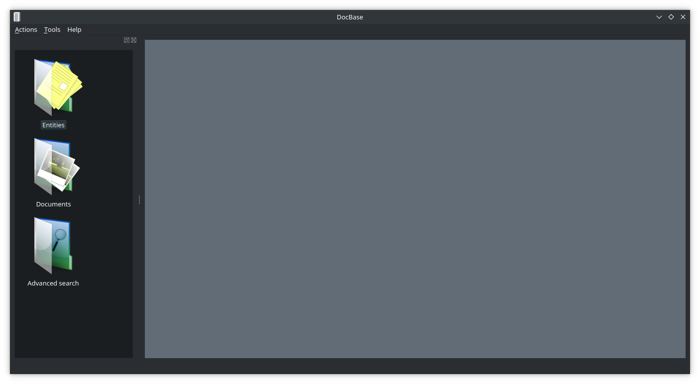

### Modules
#### Entities
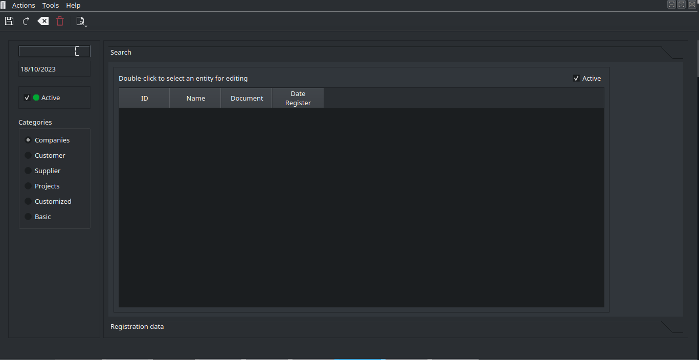
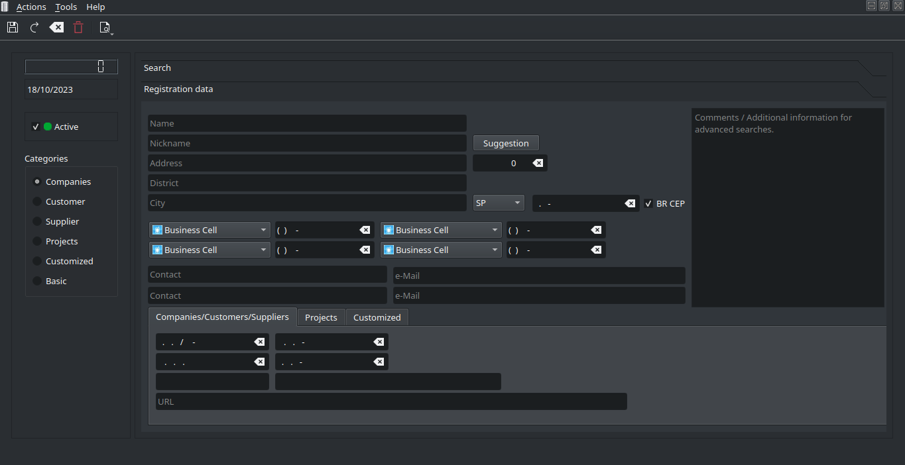

#### Documents
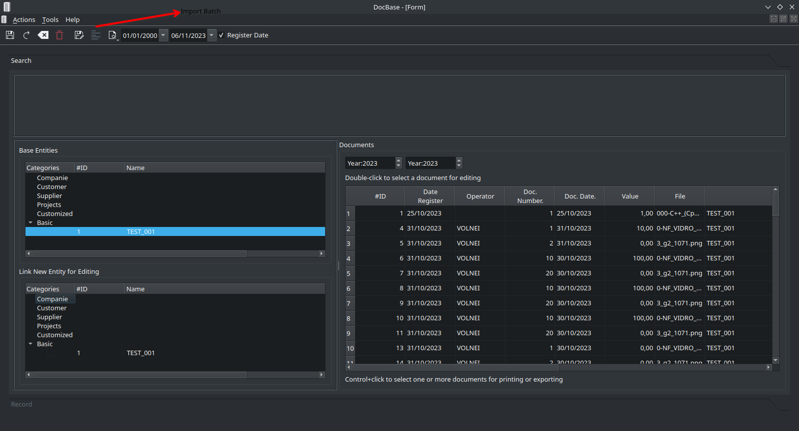
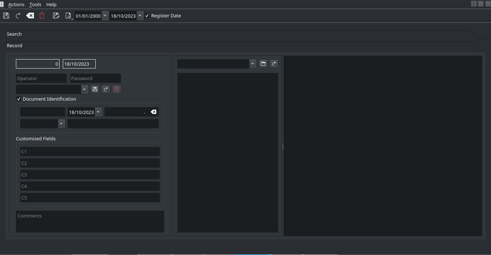
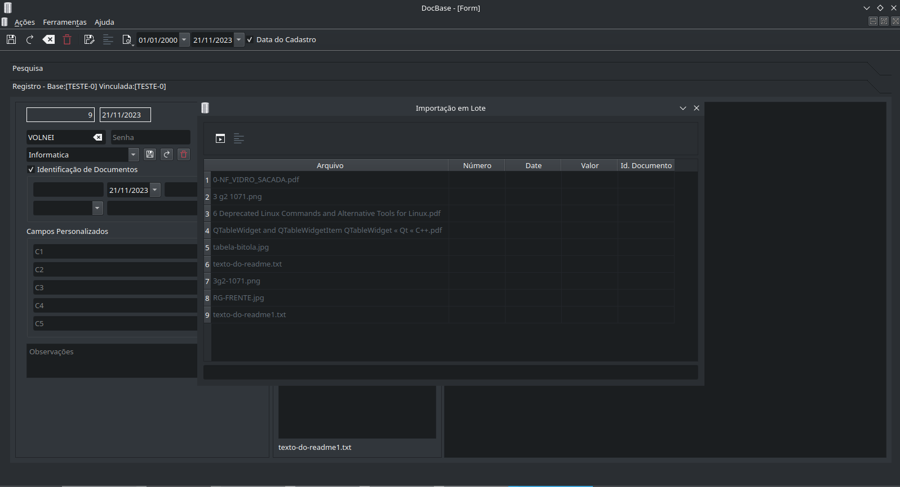

#### Search
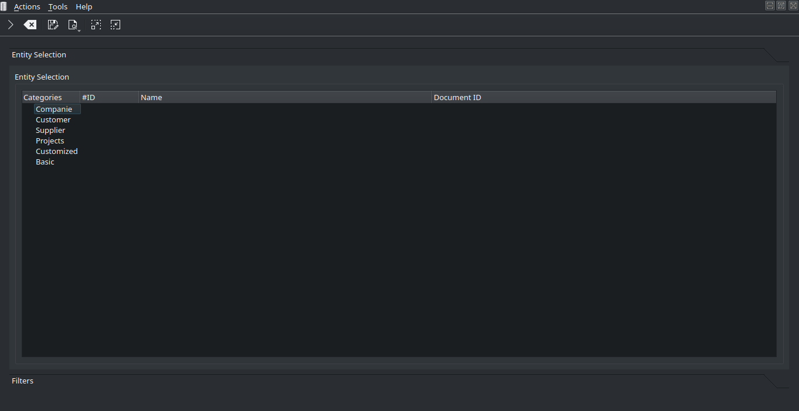
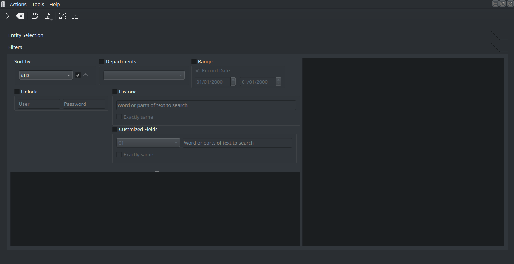

### Settings
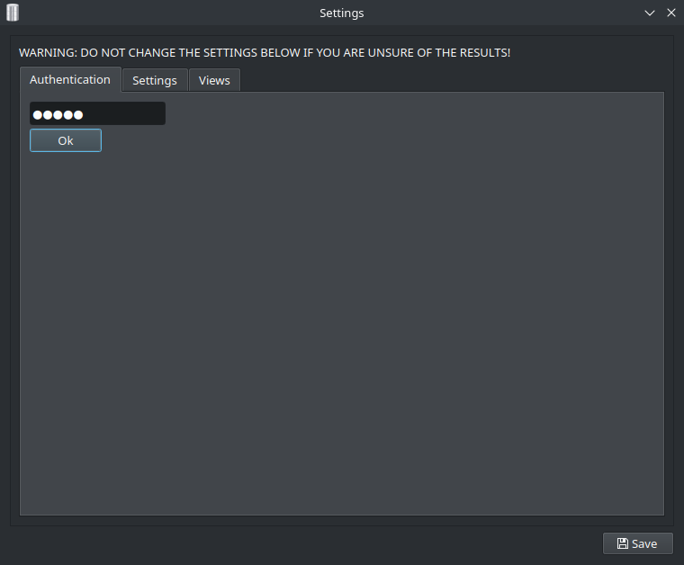
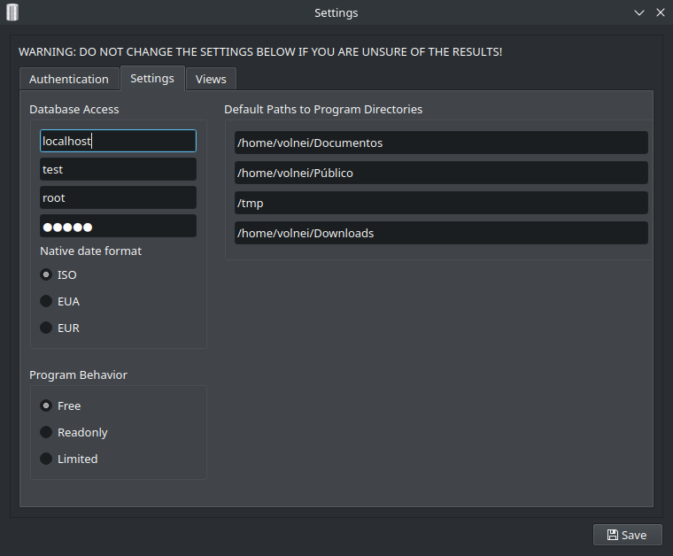
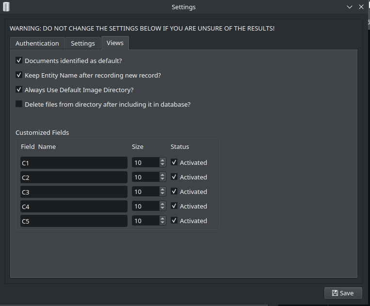

### Security
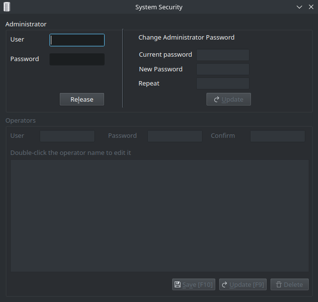

### Legal Informations
- Windows is registered trademark of Microsoft Inc. USA.
- Linux is registered trademark of Linus Torvalds.
- Qt is registered trademark of Qt Company.
- Any other brand referenced by us belongs to their respectives owners.
